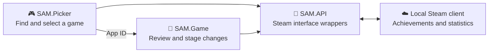

<p align="center">
  
</p>

<h1 align="center">🏆 Steam Achievement Manager</h1>

<p align="center">
  <strong>A lightweight Windows utility for viewing and managing Steam achievements and statistics.</strong>
</p>

<p align="center">
  <a href="https://github.com/gibbed/SteamAchievementManager/releases/latest"></a>
  
  
  
  <a href="LICENSE.txt"></a>
</p>

---

## 👋 About

**Steam Achievement Manager (SAM)** is a portable desktop application that communicates with the locally running Steam client. It can browse games, display achievement metadata, update supported achievements, and edit compatible statistics.

This repository is an independently maintained copy based on the open-source [Steam Achievement Manager by Rick Gibbed](https://github.com/gibbed/SteamAchievementManager). It is not affiliated with or endorsed by Valve Corporation.

> [!CAUTION]
> SAM writes achievement and statistic data to the Steam account currently signed in on your computer. Changes may appear on your profile and may not always be reversible, especially for protected or increment-only values. Review every change before committing it. Some games, services, communities, or competitive systems may prohibit external modification of achievements or statistics. Use the application only with games you own and entirely at your own risk.

## ✨ Features

- 🎮 Browse games detected through the running Steam client.
- 🔎 Search the library and filter games, demos, mods, or miscellaneous entries.
- ➕ Open a title directly by entering its Steam App ID.
- 🏅 View achievement names, descriptions, icons, states, and unlock times.
- 🔓 Lock, unlock, or invert individual and multiple achievements.
- 📊 View and edit supported integer and floating-point statistics.
- 🛡️ Detect protected achievements and statistics that cannot be edited.
- 🔄 Refresh data from Steam before applying changes.
- 💾 Commit staged achievement and statistic changes through Steam User Stats.
- ♻️ Reset supported statistics, with an option to reset achievements as well.
- 📦 Run as a portable application—no installer is required.

## 🧰 Requirements

| Requirement | Details |
| --- | --- |
| Operating system | Windows desktop; a currently supported Windows release is recommended |
| Runtime | [.NET Framework 4.8](https://dotnet.microsoft.com/download/dotnet-framework/net48) |
| Architecture | x86 process support, including on 64-bit Windows |
| Steam | Desktop client installed, running, and signed in |
| Network | Required for the game list, artwork, and other metadata |

> [!IMPORTANT]
> Extract SAM to its own folder. The application intentionally refuses to run from inside the Steam installation directory.

## 📦 Download

Prebuilt binaries are published by the original project:

### [⬇️ Download the latest upstream release](https://github.com/gibbed/SteamAchievementManager/releases/latest)

Download the release archive, extract every file to the same folder, and keep the executables and `SAM.API.dll` together.

For development or auditing, clone this repository and build the solution from source using the instructions below.

## 🚀 Quick start

1. Install and start the Steam desktop client.
2. Sign in to the Steam account you intend to use.
3. Extract the SAM release outside the Steam installation directory.
4. Launch **`SAM.Picker.exe`**.
5. Search for a game or enter its App ID manually.
6. Select the game to open its achievement and statistic manager.
7. Stage only the changes you understand, then select **Commit Changes**.
8. Refresh the view and confirm that Steam accepted the update.

Statistic editing is disabled until you explicitly acknowledge the warning shown in the **Statistics** tab. Protected or game-controlled values may still be unavailable.

## 🧭 How it works



`SAM.Picker` discovers and launches a game-specific manager. `SAM.Game` loads that title's schema and current user statistics. `SAM.API` provides the x86 bindings used to communicate with the local Steam client.

## 🏗️ Build from source

### Prerequisites

- Visual Studio 2019 or newer with the **.NET desktop development** workload, or equivalent MSBuild tools.
- .NET Framework 4.8 Developer Pack.
- NuGet command-line client when using the commands below.

### Command line

Run these commands from a Visual Studio Developer PowerShell prompt:

```powershell
nuget restore SAM.sln
msbuild SAM.sln /m /p:Configuration=Release /p:Platform=x86
```

Release binaries are written to the `upload/` directory. Keep these files together when distributing or running the application:

```text
SAM.Picker.exe
SAM.Game.exe
SAM.API.dll
```

### Visual Studio

1. Open `SAM.sln`.
2. Select the **Release** configuration.
3. Select the **x86** platform.
4. Build the solution.

## 🧩 Project structure

| Path | Responsibility |
| --- | --- |
| `SAM.API/` | Native Steam client bindings, callbacks, interfaces, and wrappers |
| `SAM.Picker/` | Game browser, filtering, artwork downloads, and manager launcher |
| `SAM.Game/` | Achievement viewer, statistic editor, schema parsing, and commit UI |
| `SAM.sln` | Visual Studio solution containing all three projects |
| `.appveyor.yml` | Upstream Windows build and packaging configuration |

## 🗺️ Roadmap ideas

These are improvement ideas, not implemented features:

- [ ] 🧾 Add a pre-commit diff, automatic JSON snapshot, and guarded restore workflow.
- [ ] 🛡️ Enforce schema limits such as minimum, maximum, maximum change, increment-only, and trusted-server flags.
- [ ] 🧠 Keep pending changes in a dedicated model so filtering, refreshing, or rebuilding the UI cannot lose them.
- [ ] 🌐 Replace legacy downloads with `HttpClient`, cancellation, timeouts, retries, safe UI-thread progress, and a local cache.
- [ ] 🗃️ Remove the single game-list dependency by combining cached metadata with local Steam library discovery.
- [ ] 🔌 Harden Steam callbacks and native wrappers with guaranteed cleanup and clearer interface-compatibility errors.
- [ ] 🧪 Add automated tests for KeyValue parsing, schema mapping, filters, callbacks, and statistic rules.
- [ ] ⚙️ Add GitHub Actions builds for `main`, reproducible x86 artifacts, SHA-256 checksums, and optional signing.
- [ ] 🩺 Add structured diagnostic logging and a privacy-safe **Copy diagnostics** report.
- [ ] 💎 Surface hidden achievements, global rarity, progress, and additional sorting options.
- [ ] 🎨 Add localization, accessibility improvements, high-DPI support, keyboard navigation, and system-aware theming.
- [ ] 🚀 Evaluate a modern .NET migration without breaking the required Steam x86 integration.
- [ ] 🔄 Automate upstream synchronization and surface conflicts early.

## 🤝 Contributing

Contributions are welcome. To keep changes easy to review:

1. Open an issue describing the problem or proposed improvement.
2. Keep each pull request focused on one topic.
3. Build and test using **Release | x86**.
4. Do not commit `bin/`, `obj/`, `upload/`, or private account data.
5. Preserve existing copyright and license notices.

When reporting a bug, include the Windows version, Steam client state, affected App ID, reproduction steps, and the exact error message. Never post Steam credentials, session tokens, or other account secrets.

## 🙏 Credits

- **Rick Gibbed** and the [original project contributors](https://github.com/gibbed/SteamAchievementManager/graphs/contributors) for Steam Achievement Manager.
- **Pavel Djundik**, Laurent B, and other contributors whose work appears in the project history.
- The [Fugue Icons](https://p.yusukekamiyamane.com/) project for most interface icons.

## 📜 License

The source code is distributed under the permissive [zlib License](LICENSE.txt). Modified versions must be clearly identified and must retain the applicable license notices. This repository's alterations are recorded in its Git history and do not claim authorship of the original software.

---

<p align="center">
  <strong>Use responsibly. Understand every change before you commit it. 🎯</strong>
</p>
